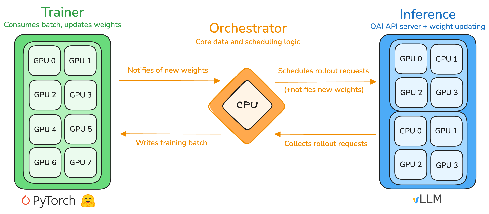

# Entrypoints

## RL

The main usecase of PRIME-RL is RL training. Three main abstractions facilitate RL training: the **orchestrator**, the **trainer**, and the **inference** service.



### Orchestrator

The orchestrator is a lightweight CPU process that handles the core data and scheduling logic, serving as an intermediary between the trainer and inference service with bidirectional relays. In one direction, it collects rollouts from the inference server, assembles them into packed batches, and dispatches them to the trainer; in the other direction, it relays updated model weights from the trainer to the inference service. The orchestrator utilizes `verifiers` environments to abstract multi-turn rollout generation and scoring, leveraging async OpenAI-compatible inference clients.

### Trainer

The trainer is responsible for producing an updated policy model given rollouts and advantages. We use FSDP2 as the backend with compatibility for any HuggingFace (HF) model. For some models we also provide custom implementations, mostly for performance reasons. FSDP shards model parameters, gradients, and optimizer states, allowing training large models with data parallelism and minimal GPU memory footprint. We support a variety of popular training objectives, such as GRPO, GSPO, OPO, RLOO and [CISPO](https://arxiv.org/abs/2506.13585). The trainer is inspired by [`torchtitan`](https://github.com/pytorch/torchtitan) and relies on native PyTorch features to implement advanced parallelism techniques, such as tensor, context or expert parallelism.

### Inference

The inference service in its simplest form is a standard OpenAI-compatible server with a vLLM backend. The API specification is extended with two custom endpoints to enable updating the server with the latest policy: `update_weights` is used to reload model weights from a HF-compatible checkpoint on disk, and `reload_weights` is used to reset the weights to the base model in between experiments. Otherwise, we rely on vLLM's optimized kernels, parallelism strategies, and scheduling for fast rollout generation. Given the disaggregated nature of the service architecture, it can be directly extended to include multiple engines with a shared request pool, allowing operation across multiple clusters and straightforward integration of alternative inference engines (e.g. SGLang, Tokasaurus). We also heavily rely on native data parallelism in vLLM (also available in SGLang) for orchestrating the fleet of nodes dedicated to inference. 

### RL

For doing RL training all components need to be started. One can do this manually:

```bash
uv run inference ...
```

```bash
uv run orchestrator ...
```

```bash
uv run trainer ...
```

Or, alternatively on a single node, use the `rl` entrypoint to start all components.

```bash
uv run rl \
    --trainer @ path/to/train.toml \
    --orchestrator @ path/to/orch.toml \
    --inference @ path/to/infer.toml \
    ...
```

For more details on multi-node deployment options, see the [deployment](deployment.md) documentation and see the [examples](examples) for concrete training configurations. To see all available configuration options, run `uv run rl --help`.

## SFT

We provide a fairly straight-forward SFT trainer which is capable of fine-tuning any conversational model on multi-turn conversation with tool calling. It shares a lot of components with the RL trainer, such as the modeling code, parallelism techniques, checkpoint format, logger, etc. which ensures a seemless post-training workflow.

To start an SFT training, you need to prepare a dataset in [prompt-completion format](https://huggingface.co/docs/trl/en/dataset_formats#prompt-completion) (we do not support any other format). Single-turn fine-tuning should be compatible with the chat templates of most models. However, to properly handle loss masking, we require that the tokenizer's chat template satisfies a prefix property: the tokenization of any conversation prefix must be a prefix of the tokenization of the full conversation. For instance, tokenizing message 1 should yield a token sequence that forms a prefix of tokenizing messages 1 and 2, which in turn should be a prefix of tokenizing messages 1, 2, 3, and so forth. An example of a chat template that *does not* satisfy this property is Qwen3's chat template, as it strips away past think sections.

On a single GPU, start the training with the `sft` entrypoint

```bash
uv run sft ...
```

If you have access to multiple GPUs, use [`torchrun`](https://docs.pytorch.org/docs/stable/elastic/run.html) with `--nproc-per-node` to start the training. 

```bash
uv run torchrun --nproc-per-node 8 src/prime_rl/trainer/sft/train.py ...
```

For more details on multi-node deployment options, see the [deployment](deployment.md) documentation and see the [examples](examples) for concrete training configurations. To see all available configuration options, run `uv run sft --help`.

## Evals

You can eval any [verifiers](https://github.com/willccbb/verifiers) environment against API models, local models and checkpoints from an SFT or RL training using the `eval` entrypoint.

> We recommned using the `vf-eval` entrypoint for debugging and developing an environment and the PRIME-RL eval entrypoint for production-grade workloads, as it has more advanced features such as multi-environment evaluation, saving results to the Environments Hub, and scales better to custom multi-node inference deployments.

By default, the entrypoint uses the OpenAI API with `gpt-4.1-mini` to provide a smooth out-of-the-box experience without requiring a vLLM server.

To check all available configuration options, run `uv run eval --help`.

### API Models

By default, the entrypoint uses the OpenAI API. First, set the API key as an environment variable:

```bash
export OPENAI_API_KEY=...
```

### Single Environment

```bash
uv run eval @ configs/debug/eval/single_env.toml
```

### Multiple Environments

```bash
uv run eval @ configs/debug/eval/multi_env.toml
```

### Local Models

To use a different API, or custom inference deployment, override the client and model configuration. For example, for a bare vLLM server, run:

```bash
uv run eval \
  @ configs/debug/eval/local_model.toml \
  --client.base-url http://localhost:8000/v1 \
  --model.name <model-name>
```

### Checkpoints

To evaluate a training checkpoints, start an inference server with the model being the base model that you started training from and specify the directory containing the weight checkpoints with `--weights-dir`. 

```bash
uv run inference --model.name <model-name>
```

```bash
uv run eval \
  @ configs/debug/eval/single_env.toml \
  --client.base-url http://localhost:8000/v1 \
  --model.name <model-name> \
  --weights-dir outputs/weights
```

By default, this will evaluate the base model and all step checkpoints found in the weights directory. To skip evaling the base model, set `--no-eval-base` and to evaluate only specific steps, set `--steps` as a comma-separated list of integers representing the steps to evaluate. For example,

## Synthetic Data

You can generate synthetic data in any [verifiers](https://github.com/willccbb/verifiers) environment using the `synthesize` entrypoint. The entrypoint shares configuration with evals (`ModelConfig`, `ClientConfig`, `SamplingConfig`, and `EnvConfig`), making it easy to generate data using the same models and sampling settings as your evaluations.

The synthesize entrypoint supports single-turn, multi-turn, and tool-calling environments, and can generate data across multiple environments in parallel. It automatically parses reasoning content from model responses (configurable via `--reasoning-field`, defaults to `reasoning_content`), and saves data in append mode using the same schema as verifiers, making it straightforward to convert to SFT datasets. The entrypoint is robust to errors during generation, scoring, or saving—failed groups are simply dropped. Environments specified in the format `{env_org}/{env_id}` are automatically installed, similar to the RL entrypoint.

By default, the entrypoint uses the OpenAI API with `gpt-4.1-mini` (also the default for evals) to provide a smooth out-of-the-box experience without requiring a vLLM server. Make sure to set your API key as an environment variable

```bash
export OPENAI_API_KEY=...
```

To check all available configuration options, run `uv run synthesize --help`.

### Single-Turn Environments

Generate synthetic data in a single-turn environment (e.g., `gsm8k`):

```bash
uv run synthesize @ configs/debug/synthesize/single_turn.toml
```

By default, the entrypoint parses and saves the `reasoning_content` field from raw responses, as returned by vLLM when a reasoning parser is set. This behavior can be configured to handle different APIs:

```bash
uv run synthesize @ configs/debug/synthesize/single_turn.toml --reasoning-field reasoning
```

### Multiple Environments

Generate synthetic data across multiple environments (e.g., `gsm8k` and `hendrycks-math`):

```bash
uv run synthesize @ configs/debug/synthesize/multi_env.toml
```

### Multi-Turn Environments

Generate synthetic data in a multi-turn environment (e.g., `alphabet-sort`):

```bash
uv run synthesize @ configs/debug/synthesize/multi_turn.toml
```

### Multi-Turn Environments with Tool Calls

Generate synthetic data in a multi-turn environment with tool calls (e.g., `wiki-search`):

```bash
uv run synthesize @ configs/debug/synthesize/multi_turn_tool_call.toml
```
