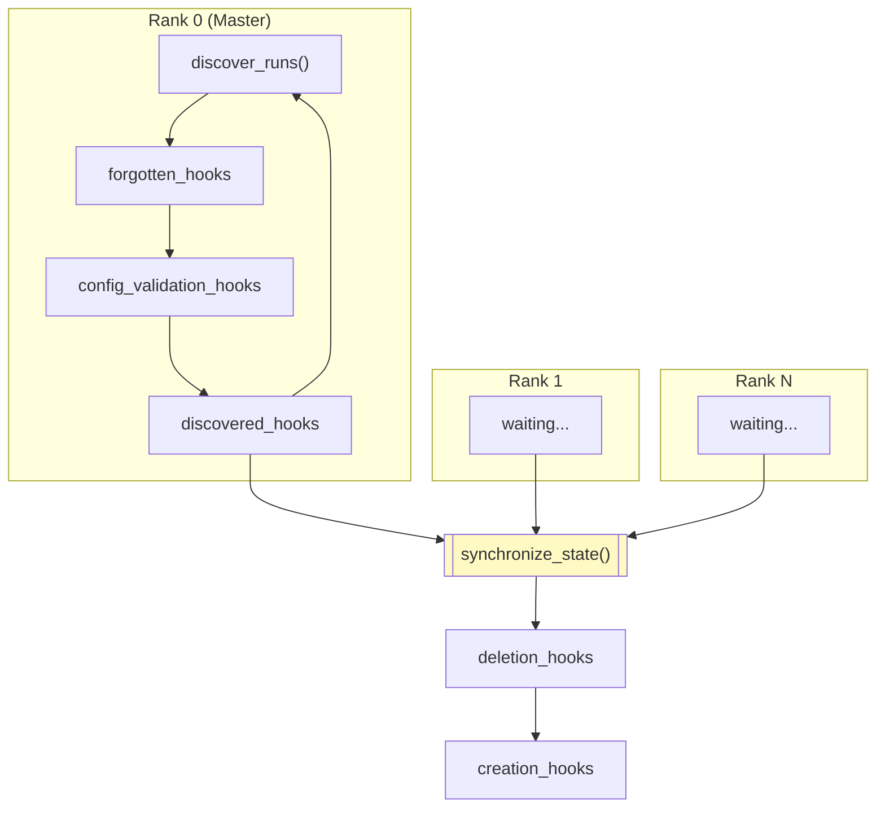

# MultiRunManager

The `MultiRunManager` object is a global singleton that manages the parameters and components for multiple concurrent training runs within a single trainer process.
This allows multiple orchestrator deployments to share the same trainer.

When `max_concurrent_runs > 1`, the trainer can train multiple runs in parallel. Each run:

- Has its own LoRA adapter parameters
- Has its own optimizer and scheduler
- Saves its own checkpoints
- Tracks its own training progress (step, tokens, samples)
- Loads its own orchestrator configuration

The `MultiRunManager` object provides:

- **Bidirectional mapping** between run IDs (e.g., `run_abc123`) and run indices (0, 1, 2, ...)
- **Progress tracking** per run (step count, total tokens, total samples)
- **Configuration management** for orchestrator configs
- **Distributed synchronization** across ranks via the PyTorch distributed store
- **LoRA module registration** for multi-adapter parameter management
- **Creation hooks** for initializing per-run resources (optimizers, schedulers)

## **Initialization and run discovery**

The `MultiRunManager` singleton is set up at the start of training:

```python
from prime_rl.trainer.runs import setup_multi_run_manager, get_multi_run_manager

# Initialize with output directory and max concurrent runs
setup_multi_run_manager(output_dir=Path("outputs/my-experiment"), max_runs=4)

# Get the singleton instance anywhere in the codebase
multi_run_manager = get_multi_run_manager()
```

Each run's directory follows this structure:

```
{output_dir}/
├── run_abc123/
│   ├── configs/
│   │   └── orch.toml          # Orchestrator configuration
│   ├── checkpoints/
│   │   └── step_100/          # Orchestrator checkpoints
│   ├── rollouts/
│   │   └── step_100/          # Rollouts
│   └── broadcast/
│       └── step_100/          # Broadcasted weights for inference
├── run_def456/
│   └── ...
└── ...

```

Runs are discovered by scanning the output directory for the pattern `run_*`. Each run must contain a valid orchestrator config at `{run_dir}/configs/orch.toml` before they are added to the active runs otherwise they are ignored. When the maximum number of runs is reached, new `run_*` directories will not be picked up until old ones are deleted.

```python
# Master rank scans for new/deleted runs
multi_run_manager.discover_runs()

# All ranks synchronize state (must be called after discover_runs)
multi_run_manager.synchronize_state()
```

The `discover_runs()` method (master only):

1. Scans the output directory for `run_*` directories
2. Detects new runs and deleted runs
3. Calls `forgotten_hook` for deleted runs (master only)
4. Loads and validates the orchestrator config for each new run
5. Updates internal mappings and data structures
6. Calls `discovered_hook` for new runs (master only)

The `synchronize_state()` method (all ranks):

1. Master broadcasts run state to all ranks via the distributed store
2. Non-master ranks catch up by calling internal `_delete_run_data` / `_create_run_data`
3. All ranks execute `deletion_hook` for deleted runs
4. All ranks execute `creation_hook` for new runs (e.g., optimizer setup, LoRA parameter reset)

## LoRA Module Registration

LoRA modules register themselves with `MultiRunManager` for parameter management:

```python
# In apply_lora_to_model()
lora_module = MultiLoRALinear(
    base_layer=base_module,
    rank=config.rank,
    n_adapters=get_multi_run_manager().max_runs,
    ...
)
lora_module.register_with_runs(get_multi_run_manager(), module_name)

```

The `MultiRunManager` object then exposes:

```python
# Get parameters for a specific run (used by optimizer creation)
multi_run_manager.get_named_parameters_for_run(idx)

# Get state dict for a specific run (used by weight broadcast)
multi_run_manager.get_state_dict_for_run(idx)

# Reset parameters for a new run
multi_run_manager.reset_run_parameters(idx)

```

## Hooks

The `MultiRunManager` object supports several types of hooks for different lifecycle events.
Deletion hooks are always called before creation hooks.



### Hook Registration

```python
# These hooks are only called on the master as only master uses `discover_runs()`
# These hooks are thus only relevant to master only components (packer)
multi_run_manager.register_discovered_hook(callback)
multi_run_manager.register_forgotten_hook(callback)

# These hooks are executed by all ranks in the order they were added during `synchronize_state()`
# This ensures DTensor creations and other distributed operations happen together
# Calling torch.dist.barrier() in a hook here should work
multi_run_manager.register_creation_hook(callback)
multi_run_manager.register_deletion_hook(callback)

# These hooks validate the orchestrator config when runs are discovered:
multi_run_manager.register_config_validation_hook(callback)
```

The callback signatures:

```python
def discovered_callback(idx: int, run_id: str, config: OrchestratorConfig) -> None:
    """Called when a new run is discovered (master only).

    Args:
        idx: The run's index (0 to max_runs-1)
        run_id: The run's ID (e.g., "run_abc123")
        config: The orchestrator config for the run
    """
    # Example: Set the scaling factor for the run
    multi_run_manager.scaling_factors[idx] = config.model.lora.alpha / config.model.lora.rank

def forgotten_callback(idx: int, run_id: str) -> None:
    """Called when a run is forgotten/removed (master only).
    
    Args:
        idx: The run's index (0 to max_runs-1)
        run_id: The run's ID (e.g., "run_abc123")
    """
    pass

def callback(idx: int, run_id: str) -> None:
    """Called when a run is created/deleted.

    Args:
        idx: The run's index (0 to max_runs-1)
        run_id: The run's ID (e.g., "run_abc123")
    """
    pass

def config_validation_callback(config: OrchestratorConfig) -> tuple[bool, str]:
    """Validate an orchestrator config.

    Args:
        config: The orchestrator config to validate

    Returns:
        (is_valid, error_message): If invalid, error_message is written to config dir
    """
    return True, ""
```
