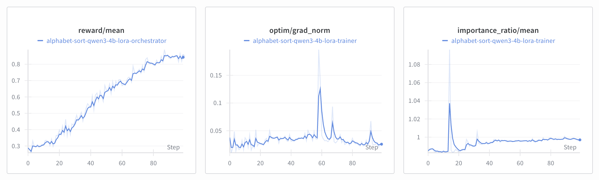

# Alphabet Sort

In this example, we demonstrate how to train `Qwen3-4B-Instruct-2507` to sort names alphabetically using LoRA. Unlike other examples, this task doesn't require SFT warmup as the base model already understands the conversation format. We proceed directly to multi-turn RL against the [`primeintellect/alphabet-sort`](https://app.primeintellect.ai/dashboard/environments/primeintellect/alphabet-sort) environment.

> This example runs on a single H100 GPU.

## Setup

Install the environment:
```bash
prime env install primeintellect/alphabet-sort
```

Verify installation:
```bash
uv run python -c "import alphabet_sort"
```

Start the tmux session:
```bash
bash scripts/tmux.sh
```

## Task

This multi-turn conversation task requires the model to:
- Sort names alphabetically by first OR last name (randomly chosen per episode)
- Maintain a cumulative sorted list across multiple turns
- Tag new names with `// new name!` marker
- Handle several names per turn

We use non-default settings to balance the difficulty: 3 fixed turns (instead of 1-3) and up to 4 names per turn (instead of 1-5). The `similarity_power=8` setting scales rewards as similarity^8, heavily penalizing even small errors.

## Baseline Evaluation

Start the inference server:
```bash
# In the `Inference` pane
uv run inference --enable-lora --model.name Qwen/Qwen3-4B-Instruct-2507
```

Evaluate the base model:
```bash
# In the `Trainer` pane
uv run vf-eval alphabet-sort \
  -m Qwen/Qwen3-4B-Instruct-2507 \
  -b http://localhost:8000/v1 \
  -n 20 \
  --max-tokens 768 \
  --env-args '{"min_turns": 3, "max_turns": 3, "min_names_per_turn": 1, "max_names_per_turn": 4, "similarity_power": 8, "power_per_turn": false}'
```

We got an **average reward of ~0.26** across 20×3 rollouts. The model achieves **0% perfect attempts** (no rollouts score 1.0) and **0% perfect examples** (no examples have all 3 rollouts at 1.0). The model shows high variance and struggles on most examples, with the high similarity power (8) heavily penalizing even small errors, and the scores aren't different for most attempts.
```
reward: avg - 0.264, std - 0.243
r1: [0.059, 0.264, 0.731, 0.23, 0.103, 0.012, 0.099, 0.115, 0.199, 0.037, 0.181, 0.014, 0.028, 0.834, 0.207, 0.625, 0.269, 0.206, 0.501, 0.558]
r2: [0.059, 0.264, 0.731, 0.23, 0.103, 0.014, 0.099, 0.115, 0.199, 0.037, 0.181, 0.014, 0.028, 0.834, 0.207, 0.625, 0.269, 0.206, 0.501, 0.558]
r3: [0.059, 0.264, 0.731, 0.23, 0.103, 0.014, 0.099, 0.115, 0.199, 0.037, 0.181, 0.014, 0.028, 0.834, 0.207, 0.625, 0.269, 0.206, 0.501, 0.558]
```

Looking at the baseline rollouts, the model simply appends new names to the end of the list without sorting, and incorrectly marks prior names as new. For example, given the task to sort by LAST name:

**Turn 1:** EnginDurgun
```
<alphabetical_sorted>
EnginDurgun
</alphabetical_sorted>
```

**Turn 2:** Add DenizCakir
```
<combined_alphabetical_sorted>
EnginDurgun
DenizCakir // new name!
</combined_alphabetical_sorted>
```

**Turn 3:** Add NurtenAkman
```
<combined_alphabetical_sorted>
EnginDurgun
DenizCakir // new name!
NurtenAkman // new name!
</combined_alphabetical_sorted>
```

The correct alphabetical order by last name should be: Akman, Cakir, Durgun. The model fails to sort, maintains insertion order, and incorrectly continues marking DenizCakir as new in Turn 3.

## RL

We train with LoRA (rank 32, alpha 64) for 100 steps.


*Check out the logs on [W&B](https://wandb.ai/primeintellect/alphabet-sort-4b-lora/workspace?nw=nwuserandrewpi).*
```bash
# In the `Trainer` pane
uv run rl @ examples/alphabet_sort/rl.toml \
  --wandb.project ... \
  --wandb.name ...
```

This will write a weight checkpoint in `outputs/weights/step_100`. Upload it to HF to be able to use it as the final model for evaluation.

```bash
uv run hf upload <user>/Qwen3-4B-Instruct-AlphabetSort-RL outputs/weights/step_100
```

We have uploaded the final model as [`PrimeIntellect/Qwen3-4B-Instruct-AlphabetSort-RL`](https://huggingface.co/PrimeIntellect/Qwen3-4B-Instruct-AlphabetSort-RL).

## Evals

Let's see how our final RL checkpoint performs on the eval set.
```bash
# In the `Inference` pane
uv run inference --enable-lora --model.name PrimeIntellect/Qwen3-4B-Instruct-AlphabetSort-RL
```

```bash
# In the `Trainer` pane
uv run vf-eval alphabet-sort \
  -m PrimeIntellect/Qwen3-4B-Instruct-AlphabetSort-RL \
  -b http://localhost:8000/v1 \
  -n 20 \
  --max-tokens 768 \
  --env-args '{"min_turns": 3, "max_turns": 3, "min_names_per_turn": 1, "max_names_per_turn": 4, "similarity_power": 8, "power_per_turn": false}'
```

Way better! Our model now gets an **average reward of ~0.81** with **73% perfect attempts** (44/60 rollouts score 1.0) and **65% perfect examples** (13/20 examples have all 3 rollouts at 1.0).
```
reward: avg - 0.805, std - 0.348
r1: [1.0, 1.0, 1.0, 1.0, 1.0, 0.035, 0.635, 1.0, 1.0, 1.0, 1.0, 0.2, 1.0, 1.0, 0.24, 1.0, 1.0, 1.0, 1.0, 0.987]
r2: [1.0, 1.0, 1.0, 1.0, 1.0, 0.035, 0.027, 1.0, 1.0, 0.416, 1.0, 0.2, 0.292, 1.0, 0.24, 1.0, 1.0, 1.0, 1.0, 0.987]
r3: [1.0, 1.0, 1.0, 1.0, 1.0, 0.047, 0.027, 1.0, 1.0, 1.0, 1.0, 0.2, 0.505, 1.0, 0.24, 1.0, 1.0, 1.0, 1.0, 0.987]
```

After training, the model now correctly sorts names and explicitly breaks down its reasoning step-by-step, even though chain-of-thought was never explicitly requested. For the same example above:

**Turn 1:** EnginDurgun
```
The given input is a single name: "EnginDurgun".

To sort by last name, we need to split the name into first and last parts. In "EnginDurgun", "Durgun" is the last name.

Since there's only one name, it remains unchanged in the sorted list.

<alphabetical_sorted>
EnginDurgun
</alphabetical_sorted>
```

**Turn 2:** Add DenizCakir
```
We are now sorting the following names by LAST name:

- EnginDurgun (from prior list)
- DenizCakir (new addition)

Step 1: Extract last names:
- EnginDurgun → Last name: Durgun
- DenizCakir → Last name: Cakir

Step 2: Sort by last name alphabetically:
- Cakir comes before Durgun

So the sorted order is:
- DenizCakir
- EnginDurgun

Note: "DenizCakir" is a new name not in the prior list.

<combined_alphabetical_sorted>
DenizCakir // new name!
EnginDurgun
</combined_alphabetical_sorted>
```

**Turn 3:** Add NurtenAkman
```
We are now adding the new name: NurtenAkman
Prior names in the list:
- DenizCakir
- EnginDurgun

New name: NurtenAkman → Last name: Akman

Extract last names:
- DenizCakir → Cakir
- EnginDurgun → Durgun
- NurtenAkman → Akman

Sort by last name alphabetically:
- Akman
- Cakir
- Durgun

So the order is:
- NurtenAkman (Akman)
- DenizCakir (Cakir)
- EnginDurgun (Durgun)

NurtenAkman is a new name.

<combined_alphabetical_sorted>
NurtenAkman // new name!
DenizCakir
EnginDurgun
</combined_alphabetical_sorted>
```

The model now correctly identifies last names, sorts them alphabetically, maintains the cumulative list, and properly tags only the newly added names.
