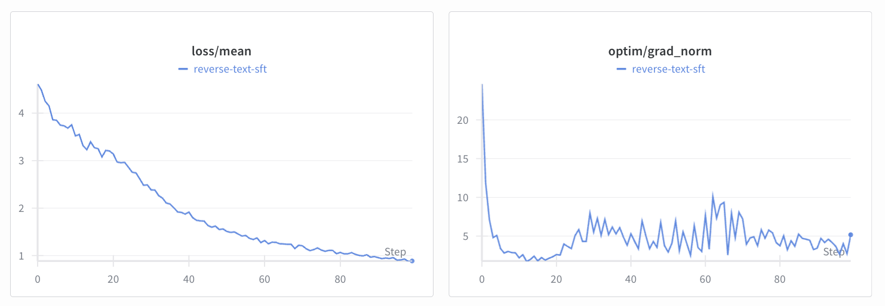
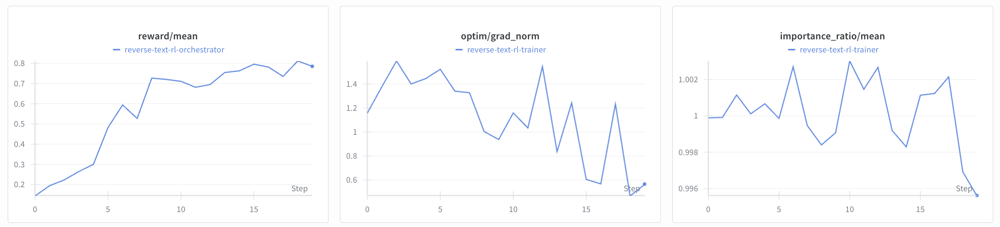

# Reverse Text

We demonstrate how to train `Qwen3-0.6B` to reverse a small chunk of text. We will use a SFT warmup to learn the skill of text reversal on longer documents and then a quick RL run to reverse smaller chunks of text in the [`reverse-text`](https://app.primeintellect.ai/dashboard/environments/primeintellect/reverse-text) environment. We use a similar setup in our CI at the moment and for development.

> The commands in this example were designed to be run on 2 GPUs (one trainer and one inference GPU). It is possible to run on less or more GPUs using different deployment strategies. If you run on a different setup, you may need to adjust the start commands.

## Setup

We keep the `reverse-text` in our lock file because we use it frequently in our CI and for development. If you have synced the environment, you should already have it installed. To verify, run

```bash
uv run python -c "import reverse_text"
```

First, let's start a `tmux` session which we will use throughout the experiment.

```bash
bash scripts/tmux.sh
```

Let's check how well `Qwen3-0.6B` does out-of-the-box on the `reverse-text` environment. 

```bash
# Run this in the `Inference` pane
uv run inference --model.name Qwen/Qwen3-0.6B
```

```bash
# Run this in the `Trainer` pane
uv run vf-eval reverse-text -m Qwen/Qwen3-0.6B -b http://localhost:8000/v1 -n 20 --max-tokens 1024
```

This is of course just a quick vibe check and no full-fledged evaluation, but we can see that the model struggles with this task. In this specific instance, we got an **average reward of ~0.05** across the 20x3 rollouts. Let's do some training!

## SFT

We will fine-tune `PrimeIntellect/Qwen3-0.6B` ([HF](https://huggingface.co/PrimeIntellect/Qwen3-0.6B)), which is a clone of `Qwen/Qwen3-0.6B` ([HF](https://huggingface.co/Qwen/Qwen3-0.6B)) with a chat template suitable for multi-turn RL, on `willcb/R1-reverse-wikipedia-paragraphs-v1-1000` ([HF](https://huggingface.co/datasets/willcb/R1-reverse-wikipedia-paragraphs-v1-1000)) which contains 1K examples of reversals of small paragraphs.


*Check out the logs of the SFT run on [W&B](https://wandb.ai/primeintellect/examples?nw=s3p14m48jod).*

To train on a single GPU, run

```bash
# In the `Trainer` pane
uv run sft @ examples/reverse_text/sft.toml \
  --wandb.project ... \
  --wandb.name ...
```

To train on multiple GPUs, run

```bash
# In the `Trainer` pane
uv run torchrun \
  --local-ranks-filter 0 \
  --nproc-per-node ... \
  src/prime_rl/trainer/sft/train.py @ examples/reverse_text/sft/train.toml \
  --wandb.project ... \
  --wandb.name ...
```

This should write a weight checkpoint in `outputs/weights/step_100`. Upload it to HF to be able to use it as the base model for RL.

```bash
uv run hf upload <user>/Qwen3-0.6B-Reverse-Text-SFT outputs/weights/step_100
```

We have uploaded the final model as [`PrimeIntellect/Qwen3-0.6B-Reverse-Text-SFT`](https://huggingface.co/PrimeIntellect/Qwen3-0.6B-Reverse-Text-SFT).

## RL

For the RL we will only do 20 steps at 8x16 rollouts, for a total batch size of 128 and sequence length 128. Because of the small context, training should be extremely quick.


*Check out the logs of the RL run on [W&B](https://wandb.ai/primeintellect/examples?nw=yxjwjc556do).*

```bash
# Run this in the `Trainer` pane
uv run rl @ examples/reverse_text/rl.toml \
  --model.name ... \
  --wandb.project ... \
  --wandb.name ...
```

This will write a weight checkpoint in `outputs/weights/step_20`. As before, let's upload it to HF.

```bash
uv run hf upload <user>/Qwen3-0.6B-Reverse-Text-RL outputs/weights/step_20
```

We have uploaded the final model as [`PrimeIntellect/Qwen3-0.6B-Reverse-Text-RL`](https://huggingface.co/PrimeIntellect/Qwen3-0.6B-Reverse-Text-RL).

## Evals

Let's see how our final RL checkpoints perform on the `reverse-text` environment.

```bash
# Run this in the `Inference` pane
uv run inference --model.name PrimeIntellect/Qwen3-0.6B-Reverse-Text-RL
```

```bash
# Run this in the `Trainer` pane
uv run vf-eval reverse-text -m PrimeIntellect/Qwen3-0.6B-Reverse-Text-RL -b http://localhost:8000/v1 -n 20 --max-tokens 1024
```

Way better! Now we get an **average reward of ~0.8**.

## Kubernetes Deployment

If you're running on Kubernetes, you can deploy this example using the provided Helm chart. The Helm chart automatically configures all components with proper networking and shared storage.

### Step 1: Deploy for SFT Training

The reverse-text example is configured with `autoStart: true` for RL training, but we need to run SFT first. Deploy with autoStart disabled:

```bash
cd k8s
helm install my-exp ./prime-rl -f ./prime-rl/examples/reverse-text.yaml \
  --set orchestrator.autoStart=false \
  --set inference.autoStart=false \
  --set trainer.autoStart=false

# Check pods are ready
kubectl get pods -l app=prime-rl,example=reverse-text
# All pods should show 1/1 Running
```

### Step 2: Run SFT Training

Exec into the trainer pod and run SFT:

```bash
kubectl exec -it my-exp-trainer-0 -- bash
uv run sft @ /app/examples/reverse_text/sft.toml --output-dir /data/outputs
# This will save checkpoints to /data/outputs/weights/step_100
```

Upload the checkpoint to HuggingFace or use it directly from shared storage:

```bash
# Option 1: Upload to HuggingFace (from within the pod)
uv run hf upload <user>/Qwen3-0.6B-Reverse-Text-SFT /data/outputs/weights/step_100

# Option 2: Use local checkpoint path in RL config
# Update the model.name in the RL configs to point to /data/outputs/weights/step_100
```

### Step 3: Deploy RL Training

Now upgrade the deployment to enable autoStart (uses the default `autoStart: true` from reverse-text.yaml):

```bash
# Exit the pod first (Ctrl+D)
cd k8s
helm upgrade my-exp ./prime-rl -f ./prime-rl/examples/reverse-text.yaml

# Check pods have restarted
kubectl get pods -l app=prime-rl,example=reverse-text
```

The RL components will automatically start. Monitor the logs:

```bash
# View inference server logs
kubectl logs -f my-exp-inference-0

# View orchestrator logs
kubectl logs -f my-exp-orchestrator-0

# View trainer logs
kubectl logs -f my-exp-trainer-0
```

### Alternative: Manual RL Training

If you prefer to run RL components manually, keep `autoStart: false` and exec into each pod:

```bash
# Terminal 1 - Inference
kubectl exec -it my-exp-inference-0 -- bash
uv run inference @ /app/examples/reverse_text/rl/infer.toml

# Terminal 2 - Orchestrator
kubectl exec -it my-exp-orchestrator-0 -- bash
uv run orchestrator @ /app/examples/reverse_text/rl/orch.toml --output-dir /data/outputs --client.base-url '["'$INFERENCE_URL'"]'

# Terminal 3 - Trainer
kubectl exec -it my-exp-trainer-0 -- bash
uv run trainer @ /app/examples/reverse_text/rl/train.toml --output-dir /data/outputs
```

### Access Outputs and Checkpoints

All outputs are written to `/data/outputs` on the shared NFS storage:

```bash
# Exec into any pod to access outputs
kubectl exec -it my-exp-trainer-0 -- bash
ls -lh /data/outputs/weights/
ls -lh /data/outputs/rollouts/
```

### Step 4: Run Evaluation

To evaluate the trained RL model:

```bash
# Exec into trainer pod
kubectl exec -it my-exp-trainer-0 -- bash

# If inference server isn't running with the RL model, start it in another terminal:
kubectl exec -it my-exp-inference-0 -- bash
uv run inference --model.name /data/outputs/weights/step_20

# Back in trainer pod, run evaluation
uv run vf-eval reverse-text \
  -m /data/outputs/weights/step_20 \
  -b $INFERENCE_URL \
  -n 20 --max-tokens 1024
```

### Clean Up

```bash
helm uninstall my-exp
# Optionally delete shared data:
kubectl delete pvc prime-rl-shared-data
```

**What the Helm chart provides:**
- Predictably named pods: `<release-name>-trainer-0`, `<release-name>-inference-0`, `<release-name>-orchestrator-0`
- Shared NFS storage at `/data` for model checkpoints and outputs
- GPU resources (1 GPU per inference/trainer pod)
- Kubernetes services for component communication
- Auto-start capability with proper networking configured

See the [K8s deployment guide](../../k8s/README.md) for more details on scaling, distributed training, and advanced configurations.